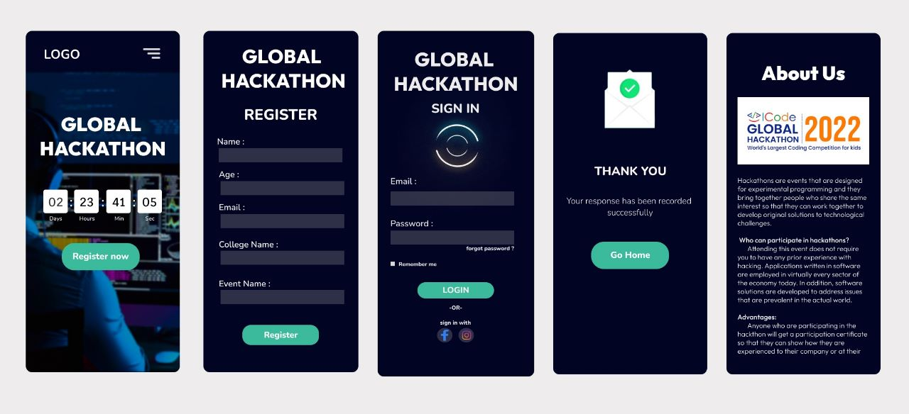

# Event Registration Web Application

## AIM:
To design, develop and deploy a web application for event registration.

## DESIGN STEPS:

### Step 1:
Create a Django project using django commands.

### Step 2:
Make necessary changes in the settings.py file.

### Step 3:
Create a static folder and add the HTML folder and CSS folder and create HTML file and CSS file.

### Step 4:
Execute the HTML file in Webpage and take the screenshot of it.

### Step 5:
Upload the file to your GITHUB account using git commands.

### Step 6:

Validate the HTML and CSS code.

### Step 6:

Publish the website in the given URL.

## DESIGN:

## PROGRAM :

## OUTPUT:

## Result:
The program is executed successfully.

